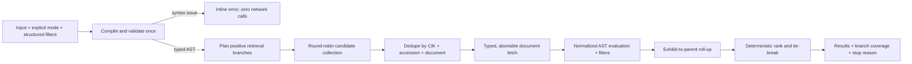

# Boolean search remediation plan

**Date:** 2026-07-21  
**Scope:** Boolean mode in Filing Research and every direct caller of the filing-research service  
**Status:** implementation-ready plan; no production behavior is changed by this document  
**Primary objective:** make Boolean results logically correct, deterministic, rate-limit-safe, and honest about the portion of the SEC corpus that was validated.

## 1. Executive decision

Repair Boolean search inside the application's existing client/service/API architecture. The first repair should not add a search database, a new permanent feature-flag system, query rewriting, or more query-language features.

The implementation should follow this sequence:

1. revert the unsafe inline `auditor:` addition in commit `3605426`;
2. establish one strict Boolean syntax and matching contract;
3. replace flattened candidate generation with branch-aware retrieval;
4. make document-fetch failures and search coverage typed and truthful;
5. enforce hard request budgets, deterministic ordering, and latest-request-wins behavior;
6. make company selection a CIK scope and roll exhibit matches up to their parent filing;
7. update examples and help only after the executable behavior passes the same fixtures; and
8. validate an immutable Vercel preview before promoting that exact build.

This repair can guarantee correct evaluation and unbiased, disclosed branch coverage inside a bounded candidate window. It cannot honestly guarantee exhaustive results for an unbounded SEC corpus. Exhaustive corpus-wide Boolean search would require a maintained full-text index or batch validation service and is a separate project.

## 2. Why this work is required

The existing tests pass, but the principal failures occur between parsing, candidate collection, document retrieval, and coverage reporting.

Confirmed examples from the audit:

- SEC candidate counts showed at least 10,000 results for `mezzanine OR temporary` and 2,855 for `mezzanine AND temporary`, but the application returned the same five filing IDs for both. It searched the intersection first and stopped before an independent OR branch.
- `ASR OR (EPS AND GAAP)` creates many intersection and case-variant queries; the first true OR branch falls after the executor's query cap and may never run.
- `revenue AND` can reach retrieval when invoked outside the guarded page flow because a parse failure is currently interpreted as “text validation not required.”
- identical punctuation can fail to match: `10-K`, `non-GAAP`, `ASC-842`, `R&D`, `U.S. GAAP`, and apostrophe-containing phrases.
- quoted phrases use substring behavior: `"net income"` can match `planet income`, and `"risk"` can match `brisk`.
- a 404, 415, 429, timeout, or other filing-text failure is converted to empty text and can be counted as a successfully examined nonmatch.
- the normal enriched route returns `pageCoverage` while the client expects `candidateCoverage`; missing coverage can default to complete even when the upstream total is at least 10,000.
- the executor may attempt to validate 500 documents even though `/api/sec-proxy` allows 180 requests per user per five minutes.
- lowercase prose containing `and`, `or`, `not`, quotes, or parentheses can silently switch from Filing Research to Boolean mode.
- selecting Apple in Boolean mode inserts `AAPL` as filing text instead of applying Apple's CIK as issuer scope.
- exhibit-heavy candidate windows are searched and then discarded, hiding disclosures that appear only in an attachment such as EX-99.1.
- a slow earlier search can overwrite a newer search because initial results and status callbacks do not have a shared request identity.

## 3. Reconcile the code already on `main`

The repository was clean at `3605426` when this plan was written, and that commit was already on `main` and `origin/main`.

### 3.1 Revert `3605426` as the first implementation change

Commit `3605426` added inline `auditor:<firm>` syntax by extracting a token with a regular expression and applying the extracted auditor as a global structured filter. That changes Boolean meaning:

| Input | Current transformation | Correct Boolean meaning |
|---|---|---|
| `lease OR auditor:KPMG` | `lease` plus global KPMG filter | lease match **or** KPMG metadata match |
| `(lease AND auditor:KPMG)` | captures punctuation and can leave an unbalanced expression | grouped conjunction |
| `lease AND auditor:KPMG AND risk` | can leave adjacent operators | three valid operands |
| two auditor fields | one may remain as literal text | both must have defined field semantics or be rejected |

The Advanced Filters panel already provides an auditor constraint, so inline field syntax is an unrequested feature rather than a prerequisite for fixing Boolean search. Revert all five files touched by `3605426`, including the examples and Support copy. Do not retain the regex extractor.

If inline field predicates are explicitly requested later, implement them as typed AST nodes so `OR`, grouping, multiple fields, and conflicts preserve their logic. They are a non-goal for this repair.

### 3.2 Retain and correct the useful parts of `238350c`

Retain:

- removal of greedy proximity-operand merging;
- removal of fabricated `-ation` stems;
- the `describeBooleanQueryIssue` concept; and
- local SearchPage and AccountingHub syntax feedback.

Correct:

- detect unmatched quotes before tokenization can auto-close them;
- enforce compilation at the `executeFilingResearchSearch` service boundary, not only in views;
- replace the test that currently accepts an unclosed quote;
- explicitly reject unsupported grouped or chained proximity; and
- replace the candidate generator rather than extending its ordered flat list.

The temporary probe suite should become assertion-based regression coverage in the main Boolean test files. It must not remain a console-output diagnostic.

## 4. User-facing Boolean contract

The implementation and help content must use one contract.

| Concern | Contract for this repair |
|---|---|
| Mode | The user's explicit mode selection is authoritative. Boolean operators are case-insensitive after Boolean mode is selected. Lowercase prose, quotation marks, or parentheses alone do not silently change Filing Research into Boolean mode. |
| AND | Both operands must match. Whitespace between adjacent operands remains implicit AND. |
| OR | Either operand may match. Retrieval must attempt every positive OR branch before the run can be complete. |
| NOT | Excludes matches after a positive candidate anchor is retrieved. Pure-negative expressions are rejected because they do not define a bounded candidate universe. Double NOT toggles polarity correctly. |
| Precedence | `NOT` > proximity > explicit/implicit `AND` > `OR`. Parentheses override precedence. |
| Bare term | Case-insensitive match against complete normalized tokens. No undocumented prefix or suffix stemming. |
| Quoted phrase | Contiguous normalized token sequence with token boundaries; never a raw substring. |
| Punctuation | Query and filing text use the same Unicode-aware normalization. Hyphens, slashes, periods, ampersands, and straight/curly apostrophes normalize symmetrically. |
| Proximity | `W/n`, `WITHIN/n`, and `NEAR/n` are aliases for unordered proximity with at most `n` intervening normalized tokens. Operands may be one term or one quoted phrase. |
| Complex proximity | Grouped or chained proximity is rejected with a specific syntax message for this release. It must not parse successfully and return a false zero. |
| Structured filters | Different filter families combine with AND. Multiple selected values inside one inclusive family combine with OR. All active filters are enforced in every mode. |
| Issuer selection | Selecting a company applies its CIK as structured scope and does not insert its ticker into the Boolean expression. |
| Result scope | Filing Research returns one row per filing. A matching exhibit is retained as evidence and rolled up to its parent filing. |
| Coverage | Results are exact matches among successfully validated candidates. A bounded or interrupted run is explicitly partial and never described as exhaustive. |

Examples that become contract tests:

| Query | Filing text | Expected |
|---|---|---|
| `10-K` | `Form 10-K` | match |
| `non-GAAP` | `non GAAP measure` | match |
| `R&D` | `R & D expenditures` | match |
| `U.S. GAAP` | `US GAAP` | match |
| `"management's assessment"` | curly or straight apostrophe | match |
| `"net income"` | `net-income increased` | match |
| `"net income"` | `planet income increased` | no match |
| `risk` | `brisk demand` | no match |
| `audit` | `auditory signal` | no match |

## 5. Target pipeline



The semantic Filing Research path should remain unchanged except where it shares a corrected transport or coverage type. The repair should introduce Boolean-specific helpers rather than rewriting all search modes into a new framework.

## 6. Target architecture

### 6.1 One strict compiler and one matcher

Primary file: `src/utils/booleanSearch.ts`

Introduce one public compile path:

```ts
type BooleanCompileResult =
  | { ok: true; ast: BooleanExpression; branches: RetrievalBranch[] }
  | { ok: false; code: BooleanIssueCode; offset?: number; message: string };

compileBooleanQuery(raw: string): BooleanCompileResult
```

Requirements:

- tokenize, parse, and validate once;
- reject unmatched quotes/parentheses, dangling operators, invalid distances, pure-negative expressions, and unsupported proximity forms;
- keep AST semantics intact through retrieval planning;
- build one normalized token-and-span index for both terms and phrases;
- remove ad hoc morphology and undocumented aliases; and
- use the same compiler in views, saved-alert checks, AI Q&A, Accounting Hub, and the filing-research service.

For implementation simplicity, the branch planner may remain in `booleanSearch.ts`. Extract `src/services/booleanCandidatePlanner.ts` only if the pure planner makes that file materially easier to test; do not create a general query framework.

### 6.2 Branch-aware candidate planning

Compile the positive Boolean structure into bounded retrieval branches:

- `A OR B` creates independent A and B lanes;
- `(A OR B) AND C` creates A+C and B+C lanes;
- NOT terms do not become positive candidate queries;
- an AND branch may try a selective compound query, but it retains recall-preserving fallback lanes;
- every required branch gets at least one attempt before surplus budget goes to productive branches;
- equivalent case or alias variants are deduplicated before caps; and
- a complexity cap, initially 16 expanded branches, returns a clear “query too complex” issue instead of silently approximating logic.

Do not apply the display limit as a retrieval-completion condition. A broad first branch may fill five visible rows, but a rare second OR branch must still be attempted.

### 6.3 Deterministic bounded execution

Primary file: `src/services/filingResearch.ts`

Add a Boolean-specific executor inside the existing service:

- validate before the first API call;
- allocate collection budget across branches before giving surplus to one branch;
- deduplicate candidates by CIK, accession, and document name before fetching text;
- keep candidate membership independent of promise completion order;
- use a stable final sort: relevance, filing date, accession, then document name;
- enforce all metadata and text-dependent filters through one common path;
- preserve a 45-second user ceiling without allowing wall-clock timing to choose an arbitrary result set; and
- return a partial report when branch, request, document, or time budgets stop the run.

Per-run ceilings for the first release:

| Resource | Ceiling | Reason |
|---|---:|---|
| EFTS/enriched page requests | 60 | remains below route limits and prevents unbounded pagination |
| unique filing-text attempts | 120 | leaves 60 of the 180 proxy requests for filing previews and other application work |
| filing-text concurrency | 4 | reduces burst pressure while retaining useful throughput |
| wall-clock duration | 45 seconds | existing user-facing ceiling |

The existing `500` refinement value may remain a display/candidate target, but it cannot authorize more than 120 document attempts or imply corpus completeness.

### 6.4 Typed document fetches

Primary file: `src/services/secApi.ts`

Add a strict result for Boolean validation while preserving a string-returning compatibility wrapper for unrelated consumers:

```ts
type FilingTextOutcome =
  | { ok: true; text: string }
  | {
      ok: false;
      kind: 'not-found' | 'unsupported' | 'rate-limit' | 'timeout' | 'upstream' | 'cancelled';
      status?: number;
      retryable: boolean;
    };
```

Rules:

- never convert a transport or content failure into successful empty text;
- never cache a failed result as filing content;
- do not retry 400, 404, or 415;
- retry a transient 5xx at most once within the remaining request/time budget;
- honor `Retry-After` for 429 only if it fits the remaining budget, otherwise stop partial; and
- accept `AbortSignal` through pagination, fetch, retry delay, and validation.

### 6.5 One truthful coverage model

Primary files: `src/services/filingResearch.ts`, `src/services/secApi.ts`, `src/services/searchCoverage.ts`, and `src/app/api/es-search/route.ts`

Use one Boolean coverage report:

```ts
type BooleanCoverage = {
  complete: boolean;
  stopReason: 'exhausted' | 'candidate-cap' | 'request-budget' | 'deadline' |
    'rate-limit' | 'fetch-failure' | 'unknown-upstream' | 'cancelled';
  uniqueCandidates: number;
  branches: Array<{
    id: string;
    examined: number;
    upstreamTotal?: number;
    relation?: 'eq' | 'gte';
    complete: boolean;
  }>;
  validation: { attempted: number; succeeded: number; failed: number; skipped: number };
};
```

`complete` is true only when every required branch was exactly exhausted, every eligible unique candidate was successfully evaluated, and no cap, unknown total, deadline, cancellation, rate limit, or fetch failure occurred.

OR branch totals overlap, so the UI must not fabricate a single “X of Y” corpus fraction. Show unique validated candidates and, when needed, a concise partial reason. A partial zero must read like “No verified matches among 74 validated candidates; this search is incomplete,” not “No filings matched.”

Standardize `/api/es-search` on `candidateCoverage` for every response path. Temporarily retain `pageCoverage` as a compatibility alias for older clients. Unknown or missing coverage defaults to incomplete.

### 6.6 CIK issuer scope

Primary files: `src/components/filters/CompanyLookupField.tsx`, `src/components/filters/SearchFilterBar.tsx`, `src/views/SearchPage.tsx`, `src/services/researchSessions.ts`, and `src/services/filingResearch.ts`

- add an optional, backward-compatible `entityCik` beside `entityName`;
- preserve `{ title, ticker, cik }` when a suggestion is selected;
- leave the Boolean expression intact;
- pass CIK to both enriched and EFTS retrieval;
- resolve name-only legacy filters to CIK at the service boundary in every mode;
- serialize CIK in copied URLs and sessions; and
- clear both display value and CIK when issuer scope is cleared.

Manually entering `AAPL` as a Boolean term remains a filing-text term. Selecting Apple from the issuer control is structured scope. Tests must distinguish those actions.

### 6.7 Exhibit provenance

Do not discard `EX-*` candidates before Boolean validation. Validate the exact document found by EFTS, then group successful matches by CIK and accession for Filing Research.

A result may add optional provenance such as `matchedDocumentName`, `matchedDocumentType`, and `matchedDocumentUrl`. The main action opens the parent filing; a secondary evidence link identifies “Matched in EX-99.1.” If multiple documents in an accession match, return one stable filing row with its matched-document evidence. Exhibit Search retains its separate-document behavior.

### 6.8 Latest request wins

Primary file: `src/views/SearchPage.tsx`

- create a run ID and `AbortController` for each submission;
- track the current run per research session;
- rerunning or closing a session aborts its prior run;
- scope results, progress, coverage, degraded state, and errors to both run and session IDs;
- let an inactive session update only if the run is still current for that session; and
- prevent an old run from changing the active route or tab.

## 7. Phased implementation plan

Each phase should be a reviewable PR or commit group with its own green tests. Do not update public help ahead of executable behavior.

### Phase 0 — containment and failing characterizations (S)

Files:

- the five files changed by `3605426`;
- `src/__tests__/booleanSearch.test.ts`;
- `src/__tests__/booleanSearchProbe.test.ts`; and
- `src/__tests__/filingResearchExecution.test.ts`.

Work:

1. revert `3605426` as one unit;
2. preserve the useful `238350c` cleanup;
3. replace the unclosed-quote expectation with rejection;
4. add disjoint OR candidate fixtures that fail against the current executor;
5. add phrase-boundary, punctuation, malformed-service-call, and coverage mismatch characterizations; and
6. make the probe tests assertion-only or merge them into the permanent suites.

Exit: failures accurately reproduce the defects without touching live SEC services.

### Phase 1 — compiler, normalized matcher, and mode contract (M)

Files:

- `src/utils/booleanSearch.ts`;
- `src/__tests__/booleanSearch.test.ts`;
- `src/views/SearchPage.tsx`;
- `src/views/AccountingHub.tsx`; and
- `src/services/agentPlanner.ts`.

Work:

1. add `compileBooleanQuery` and typed issues;
2. use one normalized token index for terms, phrases, and proximity spans;
3. implement the documented precedence and NOT polarity;
4. reject unsupported proximity and pure-negative expressions;
5. require explicit mode or high-confidence uppercase/proximity auto-detection; and
6. make service consumers share the compiler rather than duplicate syntax checks.

Exit: logical evaluation is correct on a fixed corpus and invalid input makes zero network calls.

### Phase 2 — branch planner and retrieval fairness (L)

Files:

- `src/utils/booleanSearch.ts` or a small `src/services/booleanCandidatePlanner.ts`;
- `src/services/filingResearch.ts`;
- `src/__tests__/booleanCandidatePlanner.test.ts`; and
- `src/__tests__/filingResearchExecution.test.ts`.

Work:

1. plan positive AST branches without flattening OR into an all-term set;
2. deduplicate candidate lanes and case variants;
3. collect required branches round-robin;
4. apply hard budgets before display limits;
5. deduplicate candidate documents before validation; and
6. sort deterministically after the bounded validation set is settled.

Exit: exact OR unions and AND intersections pass on query-dependent mocks, including a rare second branch after a full first branch.

### Phase 3 — failure typing, coverage, and capacity safety (L)

Files:

- `src/services/secApi.ts`;
- `src/services/filingResearch.ts`;
- `src/services/searchCoverage.ts`;
- `src/app/api/es-search/route.ts`;
- `src/app/api/sec-proxy/route.ts` only if status/`Retry-After` propagation needs correction;
- `src/__tests__/secApi.test.ts`;
- `src/__tests__/esSearchRoute.test.ts`; and
- `src/__tests__/searchCoverage.test.ts`.

Work:

1. add typed, abortable filing-text outcomes;
2. keep a compatibility wrapper for unrelated detail/preview callers;
3. standardize `candidateCoverage` while retaining a temporary alias;
4. enforce the 60-page/120-document/45-second budgets;
5. distinguish branch cap, request cap, deadline, 429, fetch failure, and cancellation; and
6. ensure partial and zero-result copy uses the same report.

Exit: no failed document is a nonmatch, no capped run is complete, and a single run stays within route limits.

### Phase 4 — issuer scope, exhibits, and request identity (L)

Files:

- `src/components/filters/CompanyLookupField.tsx`;
- `src/components/filters/SearchFilterBar.tsx`;
- `src/views/SearchPage.tsx`;
- `src/services/researchSessions.ts`;
- `src/services/filingResearch.ts`; and
- focused component/service tests.

Work:

1. preserve selected CIK separately from query text;
2. enforce OR-within-family and AND-across-family structured filters;
3. validate exhibit candidates and roll them up with source provenance;
4. add run/session identity and AbortSignal propagation; and
5. protect SearchPage, Accounting Hub, AI Q&A, and Dashboard saved-alert paths.

Exit: selected-company scope, exhibit-only evidence, and latest-request-wins tests pass.

### Phase 5 — persistence, copy, browser acceptance, and release (M)

Files:

- `src/services/researchSessions.ts`;
- saved-alert types and Dashboard alert execution;
- `src/views/SupportCenter.tsx`;
- `tests/e2e/boolean-search.spec.ts` and deterministic fixtures; and
- release documentation.

Work:

1. introduce internal `BOOLEAN_ENGINE_VERSION = 2`;
2. retain legacy queries and filters but invalidate cached Boolean results;
3. baseline legacy alerts on the first explicit v2 check without announcing every newly recalled filing as new;
4. run alert checks sequentially rather than three broad Boolean searches at once;
5. update samples, field labels, precedence, proximity, issuer scope, and coverage copy;
6. make every help example an executable fixture; and
7. deploy a Vercel preview, run acceptance, and promote the identical tested build.

Exit: deterministic browser acceptance, full regression, preview smoke, and release gates are green.

## 8. Deterministic test design

### 8.1 Foundational corpus

Use a fixed corpus and assert exact IDs, ordering, coverage, and degraded reasons—not only result counts.

| ID | Filing text |
|---|---|
| D0 | neither alpha nor beta |
| D1 | alpha only |
| D2 | beta only |
| D3 | alpha beta |
| D4 | beta gamma |
| D5 | alpha beta gamma |

Expected sets:

- `alpha OR beta` → D1, D2, D3, D4, D5;
- `alpha AND beta` → D3, D5;
- `alpha AND NOT beta` → D1;
- `alpha OR beta AND gamma` → D1, D3, D4, D5; and
- `(alpha OR beta) AND gamma` → D4, D5.

Retrieval mocks must depend on their query:

- `alpha` returns D1, D3, D5;
- `beta` returns D2, D3, D4, D5; and
- `alpha beta` returns only D3, D5.

Returning the same candidates for every mock query recreates the current coverage gap and cannot prove OR recall.

### 8.2 Unit and service suites

`src/__tests__/booleanSearch.test.ts`

- truth tables, precedence, grouping, implicit AND, NOT, and double NOT;
- commutativity and equivalent-expression cases;
- all punctuation and boundary examples from the contract;
- exact gap boundary for proximity and multiple-occurrence spans;
- unmatched quotes/parentheses, dangling operators, invalid distance, pure NOT, and complex proximity; and
- explicit Boolean parsing versus high-confidence automatic detection.

`src/__tests__/booleanCandidatePlanner.test.ts`

- every positive OR branch receives an independent lane;
- NOT never anchors retrieval;
- nested expressions preserve branches;
- candidate queries are unique and bounded;
- every branch is attempted before early stop;
- one failed branch makes coverage partial; and
- `alpha OR rarebeta` retrieves the unique rare candidate even if alpha already filled the display limit.

`src/__tests__/filingResearchExecution.test.ts`

- exact OR union, AND intersection, NOT difference, and nested result sets;
- invalid input invokes no search API;
- deduplication validates one document once;
- promise completion order cannot change result membership or ordering;
- repeated cold/warm runs have identical IDs, order, and coverage;
- metadata highlights cannot bypass filing-text validation;
- all structured filters remain enforced;
- document-attempt budget is never exceeded; and
- partial/degraded reason is exact for every stop path.

`src/__tests__/secApi.test.ts`, `esSearchRoute.test.ts`, and `searchCoverage.test.ts`

- 404, 415, 429, 500, timeout, abort, retry, and `Retry-After` handling;
- successful text is cacheable and failed text is not;
- `pageCoverage` compatibility becomes canonical `candidateCoverage`;
- unknown coverage defaults partial;
- only successful unique evaluations count as examined; and
- any required branch/fetch failure makes `complete=false`.

Component tests

- selecting Apple sends CIK `0000320193`, never literal AAPL as issuer scope;
- clearing/restoring/copying the issuer filter preserves identity correctly;
- filters combine with their documented family semantics;
- search A finishing after search B cannot change B's rows, route, coverage, or error;
- every callback is scoped to the owning run and session;
- an exhibit-only match yields its parent filing and matched-document link; and
- invalid syntax shows beside the field and makes zero requests.

### 8.3 Deterministic browser suite

Add `tests/e2e/boolean-search.spec.ts` and committed fixtures. Intercept `/api/es-search`, `/api/sec-efts`, `/api/sec-proxy`, enrichment, and company-directory calls before navigation. CI must not depend on the live SEC corpus.

Journeys:

1. explicit Boolean mode returns the disjoint OR union;
2. changing OR to AND returns the exact intersection;
3. phrase, punctuation, and proximity boundaries behave as documented;
4. malformed syntax shows an inline error and sends no request;
5. lowercase natural language remains Filing Research;
6. selecting Apple scopes by CIK;
7. form/date/auditor filters return exact fixture rows;
8. simulated 429/415/fetch failure shows partial coverage, not authoritative zero;
9. delayed search A cannot overwrite completed search B;
10. exhibit-only evidence rolls up to its parent filing;
11. an identical repeat has identical IDs and order; and
12. mode, autocomplete, search, results, and errors are keyboard accessible and labeled.

Run the Boolean suite as part of the broader site-wide Playwright work described in `docs/qa/full-site-interaction-audit-2026-07-21.md`.

## 9. Persistence and migration

Introduce an optional internal `engineVersion` on research sessions and saved alerts without renaming existing browser-storage keys.

- retain legacy Boolean query strings, filters, titles, and tabs;
- invalidate cached result rows from an older engine and ask for an explicit rerun;
- do not auto-rerun restored sessions and consume SEC capacity;
- on the first explicit v2 alert check, establish a new accession baseline before showing new-filing counts;
- do not automatically run legacy Boolean alerts three at a time on Dashboard load;
- save the settled/applied expression and filters, not editable draft state; and
- keep fields optional so a rollback build safely ignores them.

## 10. Observability and privacy

Have the executor expose testable per-run diagnostics:

- engine version and operator/AST shape counts;
- branches planned and completed;
- EFTS request count;
- unique candidates;
- filing texts attempted, succeeded, and failed by reason;
- matched result count;
- duration, stop reason, and coverage completeness.

Production analytics must not include raw queries, filing text, issuer names, tickers, accessions, URL parameters, or filter values. Existing PostHog consent and disabled autocapture remain authoritative. If aggregate events are emitted, restrict them to events such as `boolean_search_completed`, `boolean_search_incomplete`, and `boolean_search_cancelled` with numeric/count and reason fields.

API logs may contain status class, duration, engine version, and an opaque run ID, but no SEC document path. Full diagnostic artifacts belong in local/CI test output, not analytics storage.

## 11. Deployment and rollback

Do not build a permanent feature-flag service. Use Vercel's immutable preview deployment, promote the tested deployment, and keep the immediately previous production deployment available for instant rollback.

If the branch-aware executor genuinely needs one release of coexistence, a temporary build-time `NEXT_PUBLIC_BOOLEAN_SEARCH_ENGINE=legacy|balanced` flag may gate retrieval only. Strict syntax validation, normalization, typed failures, and truthful coverage must never be gated. Remove the flag after one stable release.

Preview acceptance:

1. use a dedicated entitled identity and clean browser storage;
2. run the deterministic browser suite;
3. run a committed golden manifest of included and excluded accessions against fixed issuer/form/date windows;
4. confirm no 429s and verify document/page request counts;
5. verify session and saved-alert migration; and
6. run the full Vitest, lint, typecheck, build, accessibility, and site-wide browser suites.

Production smoke must remain narrow:

1. one issuer-scoped AND query with fixed dates;
2. one phrase/punctuation query;
3. one paired OR/AND query in the same issuer/date window;
4. open a known result and verify filing and matched-document identity;
5. confirm no 429/5xx, correct coverage, and acceptable latency; and
6. rerun one fixed query and compare accession order.

Do not run broad unbounded queries or an automatic saved-alert sweep during production validation.

## 12. Hard release gates

The repair is not releasable unless all gates pass:

- [ ] `3605426` is reverted, including incorrect inline-auditor examples and tests.
- [ ] malformed syntax, unmatched quotes, and unsupported proximity make zero network calls.
- [ ] exact fixture sets prove OR union, AND intersection, NOT difference, and precedence.
- [ ] AND results are a subset of OR over the same frozen corpus.
- [ ] a rare OR branch is attempted even after the first branch fills the display limit.
- [ ] twenty randomized-latency runs return identical IDs, order, and coverage.
- [ ] bare and quoted punctuation fixtures match symmetrically with token boundaries.
- [ ] no failed or aborted fetch is counted as a successful nonmatch.
- [ ] `complete=true` is impossible after a cap, unknown total, deadline, cancellation, 429, or fetch failure.
- [ ] one run makes at most 60 page requests and 120 unique document attempts.
- [ ] preview acceptance produces no self-induced 429.
- [ ] selected Apple scope sends CIK `0000320193` and never relies on literal `AAPL` filing text.
- [ ] a known EX-99.1-only match appears as one parent filing result with exact provenance.
- [ ] an old search cannot overwrite a newer run's results, route, coverage, or error.
- [ ] all Boolean-capable call paths are covered: SearchPage, Accounting Hub, AI Q&A, and Dashboard saved alerts.
- [ ] Support examples are executable fixtures and describe only shipped behavior.
- [ ] existing semantic-search and non-Boolean consumers remain green.
- [ ] full Vitest, lint, typecheck, production build, deterministic Playwright, accessibility, and bounded live canary checks pass.

Immediate rollback conditions after promotion:

- a golden accession is missing or an excluded accession is returned;
- the OR/AND set invariant fails;
- a partial run is labeled complete;
- the search-run 429 rate exceeds 2% or rises materially for two observation windows;
- ordinary bounded queries repeatedly reach the 45-second ceiling;
- the upstream-failure or zero-result rate doubles against the preview baseline; or
- saved alerts produce a false surge of “new” filings after migration.

Rollback code only. Do not delete or downgrade browser storage.

## 13. Non-goals

- no inline query fields, synonyms, AI query rewriting, or additional operators;
- no new full-text database or server-side indexing project;
- no claim of exhaustive results for an unknown or bounded upstream population;
- no generic search-framework rewrite;
- no changes to unrelated semantic-search behavior except shared transport correctness;
- no automatic broad query on restored sessions or Dashboard load; and
- no copy promising behavior before its contract tests pass.

## 14. Definition of done

Boolean search is fixed when a visitor can deliberately select Boolean mode, submit a valid expression and structured scope, receive logically correct and deterministic matches from a branch-balanced candidate window, understand whether that window is complete or partial, open the exact filing or exhibit evidence that matched, and repeat the same bounded search without a different answer caused by cache warmth, request timing, or silent upstream failure.

The engineering handoff is complete when every phase has an owner and reviewable PR, the hard gates are recorded in CI, the immutable preview has passed the golden manifest, the exact preview build is promoted, and the prior deployment remains available for rollback during the observation window.
