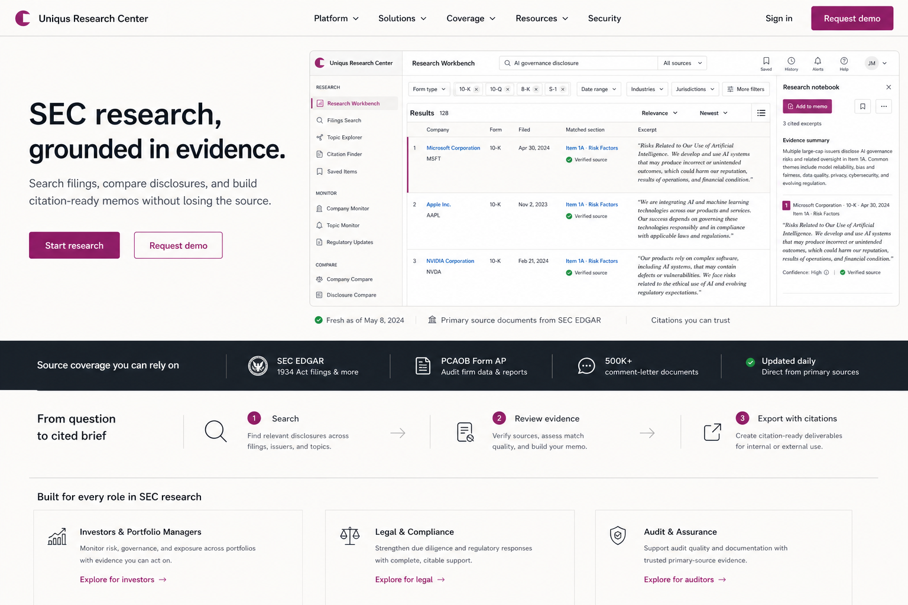
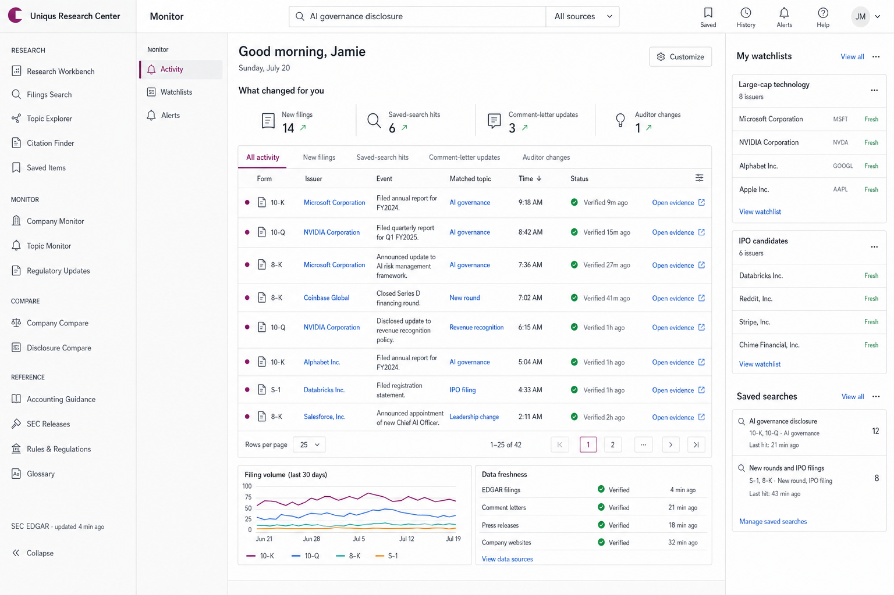
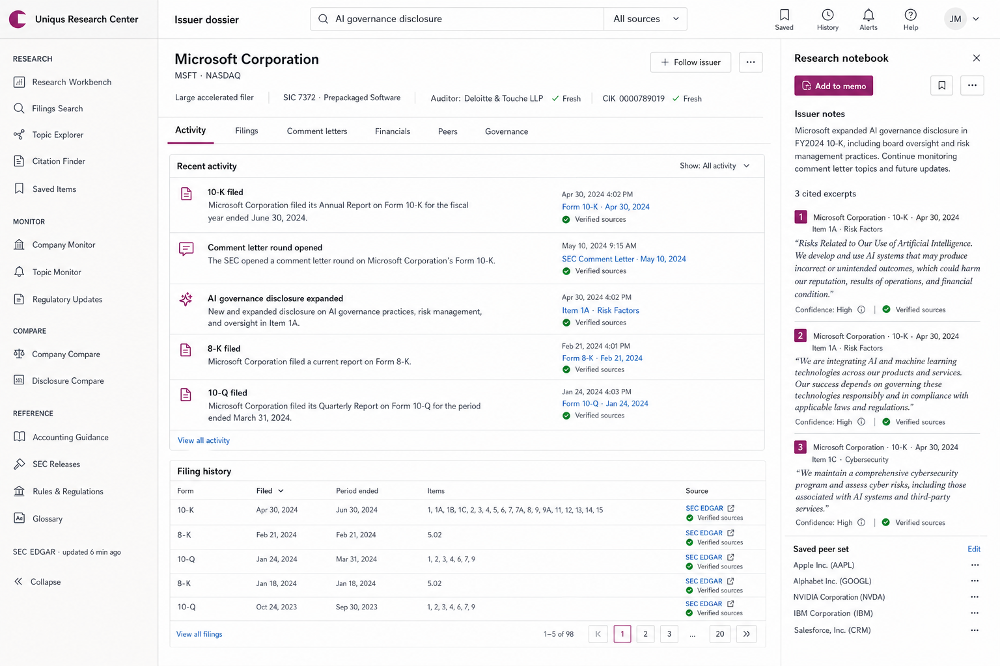
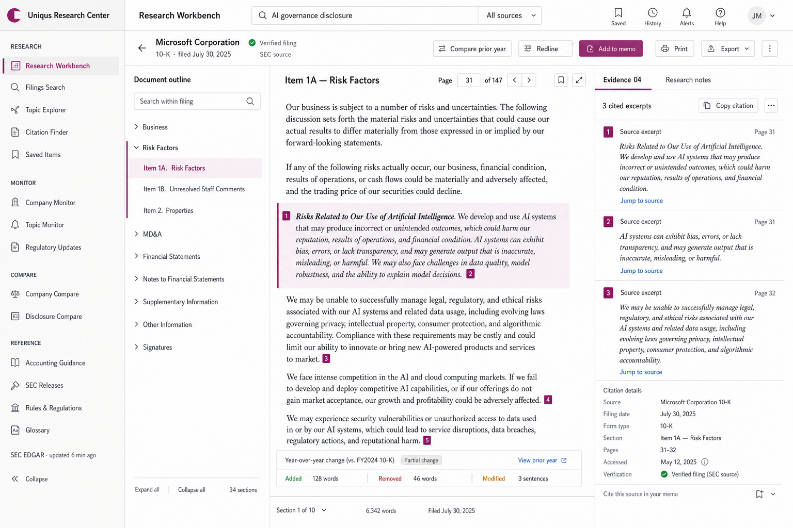
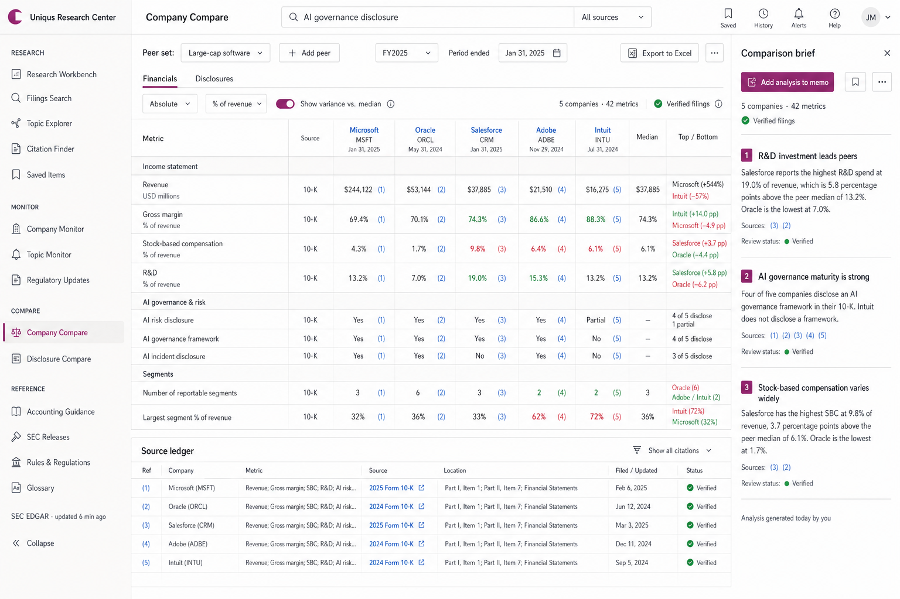
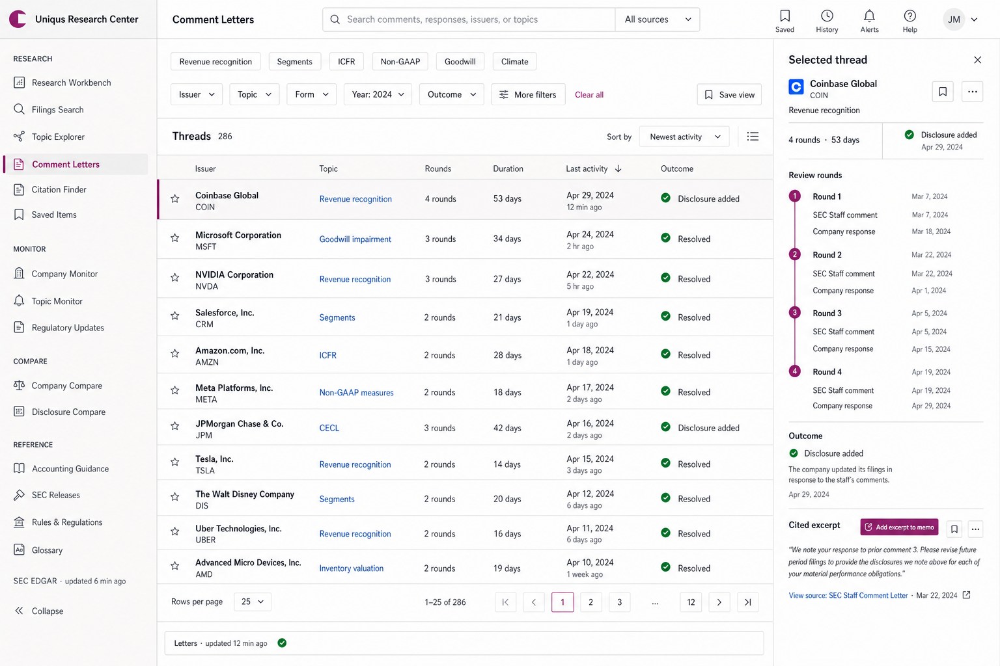

# Evidence Ledger — extended product mockups

These mockups extend the selected Evidence Ledger direction across the public
site and the product's major workflow types. They are visual concepts rather
than literal implementation specifications; sample dates, filings, metrics, and
copy should be validated before implementation.

## 04 — Public landing page

One credible workflow is the hero rather than a collage of product fragments.
Source coverage and the path from search to cited brief provide the proof.

## 05 — Monitor dashboard

The dashboard answers “what changed for me?” with an activity ledger, watchlists,
saved-search hits, and visible source freshness. Charts become supporting detail.

## 06 — Issuer dossier

Company research becomes a durable object with activity, filings, comment
letters, financials, peers, governance, auditor data, and a shared notebook.

## 07 — Filing detail

The filing workspace uses a document outline, readable source text, restrained
annotations, year-over-year comparison, and a citation/evidence rail.

## 08 — Company compare

Benchmarking is a sourced matrix rather than a collection of metric cards. Each
value or disclosure can be traced to the source ledger and summarized in a
reviewable comparison brief.

## 09 — Comment letters

SEC correspondence is modeled as review threads. Rounds, duration, outcome, and
the actual Staff/company exchange are more prominent than generic search cards.

## Shared design decisions

- Warm-white canvas and flat white work surfaces
- Ink typography with compact tabular data
- Plum only for selection, annotation, and primary actions
- Blue only for links and citations; green only for verification/freshness
- 1px dividers, 4–6px radii, and almost no elevation
- Ledgers, matrices, document panes, and source rails instead of card mosaics
- AI assistance contained in a reviewable evidence/notebook region

The generation prompts are preserved in [prompts.md](./prompts.md).

