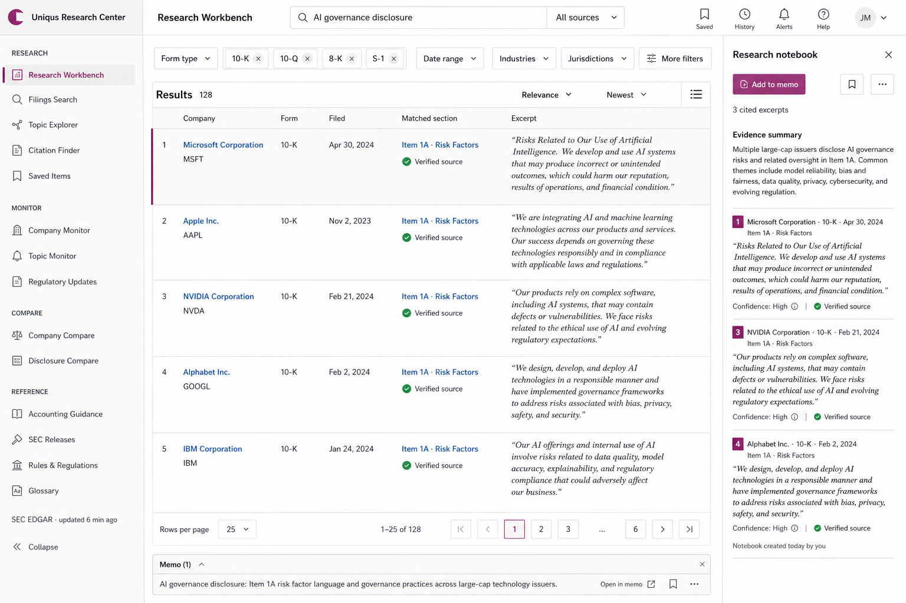
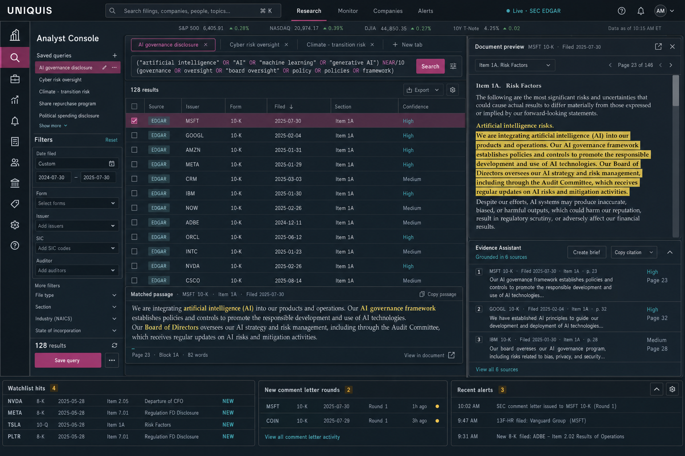
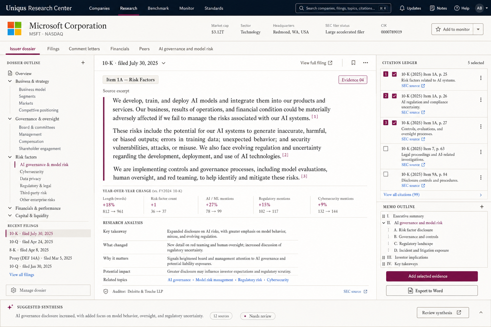

# Uniqus Research Center — total redesign plan

Date: 2026-07-19

## Executive recommendation

Rebuild the product as a professional evidence workspace, not a collection of
AI-themed dashboards. The recommended direction is **Evidence Ledger**: a
light, institutional, data-first shell with restrained Uniqus plum accents.
Use the document surface from **Research Desk** for filings, dossiers, standards,
and memo work. Reserve the denser **Analyst Console** treatment for monitoring
and high-volume review, rather than making the entire product dark.

The product should communicate, in order:

1. what source the user is looking at;
2. why it matched;
3. what changed or needs attention;
4. what the user can do with the evidence;
5. where AI helped and how its output is grounded.

## What is making the current UI feel synthetic and toy-like

- Nearly every object is a rounded card, pill, gradient, or glass surface. With
  no quiet base layer, nothing reads as primary.
- Plum/purple is used as atmosphere instead of meaning. Decorative gradients,
  glow, floating panels, and large soft shadows evoke an AI landing-page
  template rather than an evidence product.
- The landing page sells breadth through a collage of tiny product cards, but
  the composition is hard to parse and does not demonstrate a credible task.
- The application shell is dominated by a long, fully expanded product
  taxonomy. The sidebar makes the platform feel like 17 separate mini-tools.
- Core research screens combine card layouts, sidebars, assistant panels,
  filters, tabs, and helper copy without a stable density or hierarchy system.
- AI is treated as a visual identity. In a professional research product it
  should be a capability with source, confidence, and review state.
- The visual language is inconsistent with the output users need: concise,
  printable, citation-ready evidence that can move into a memo or workpaper.

## Design principles

### Evidence before assistance

The source excerpt, filing metadata, match reason, and citation are always more
prominent than the generated summary. AI lives in a docked sidecar or a clearly
labeled synthesis block; it never floats over the work.

### One canvas, not a card mosaic

Use flat page regions, dividers, tables, lists, and document panes. Cards are
reserved for genuinely self-contained objects such as a saved brief or alert.

### Compact by default, detail on demand

Professional users scan many records. Default rows should be 44–56px high,
filters should collapse into a single query bar, and the selected record should
open in a persistent detail pane.

### Color carries state

Uniqus plum marks selection, authorship, and annotations. Blue is reserved for
links/citations, green for verified/fresh, amber for review required, and red
for failure or material risk. Backgrounds remain neutral.

### The deliverable is part of the workflow

Every result can be added to a citation ledger or memo outline. “Export to
Word” and “Copy citation” are first-class actions, not end-of-flow utilities.

### Professional calm

Use 4–6px radii, 1px rules, almost no shadow, no decorative gradients, no
sparkles, no animated floating panels, and no marketing-sized type inside the
application.

## Three visual and product directions

### A. Evidence Ledger — recommended foundation

A light, institutional workbench optimized for long research sessions and
print-compatible output.

- Warm-white canvas, white work surfaces, ink typography, quiet gray rules.
- 224px job-based navigation, 52px command bar, results list/table, persistent
  right-side research notebook, and a slim memo tray.
- Strongest for research, comment letters, benchmarking, tables, and daily use.
- Risk: can feel conservative unless typography and interaction polish are
  excellent.

See the [extended Evidence Ledger screen system](./redesign-mockups/evidence-ledger-system/README.md)
for the public landing page, Monitor, issuer dossier, filing detail, company
comparison, and Comment Letters.

### B. Analyst Console — specialist mode

A high-density graphite workstation for monitoring, alerts, and repeated review.

- Compact dual-level navigation, sortable evidence grid, filing preview, and
  docked assistant.
- Strongest for watchlists, filing-event monitoring, bulk review, and users who
  keep the application open all day.
- Risk: dark surfaces reduce print friendliness and can become “terminal cosplay”
  if applied beyond the monitoring context.

### C. Research Desk — document-first model

A warm editorial workspace organized around an issuer dossier and a memo.

- Horizontal global navigation, issuer header, dossier outline, central filing
  or analysis document, and citation/memo rail.
- Strongest for filing detail, company research, standards, comment-letter
  threads, comparison narratives, and drafting.
- Risk: less efficient for scanning hundreds of results unless paired with the
  Evidence Ledger list pattern.

## Recommended information architecture

Replace the 17-item flat application map with five durable job areas:

- **Research** — Workbench, Comment Letters, Exhibits, No-Action Letters
- **Companies** — Issuer Dossiers, Peer Sets, Watchlists
- **Compare** — Benchmarking, Accounting Analytics, ESG, Boards, Insiders
- **Monitor** — Activity, Saved Searches, Filing Events, Enforcement
- **Reference** — Accounting Standards, Securities Regulation

Put IPO, M&A, Exempt Offerings, and ADV Registrations under a **Transactions**
workspace switcher or collection, not permanent first-level navigation. Put API
and Support in the account/help menu. Make the global command bar the fastest
route to any issuer, topic, saved research session, or page.

## Public landing page

The marketing site should demonstrate one credible workflow instead of trying
to visualize every module at once.

- Lead with a concrete promise such as “SEC research, grounded in source
  evidence,” followed by one primary action and one sales action.
- Use one real, full-width Evidence Ledger product screenshot rather than a
  collage of floating mini-panels.
- Follow with source coverage and freshness, three job stories, an issuer or
  topic research walkthrough, security/methodology, customer proof, and a final
  call to action.
- Keep the page light-dominant with one dark Uniqus band for contrast. Remove
  ambient gradients, floating animation, sparkles, marquee pills, and giant
  multi-line display copy.
- Replace generic “AI acceleration” claims with verifiable capabilities:
  section-level search, linked citations, year-over-year redlines, peer-set
  comparison, comment-letter threads, and Word/Excel export.

## Page archetypes

Build a small number of reusable page systems rather than redesigning 30 pages
independently.

### 1. Search and review

Used by Workbench, Comment Letters, Exhibits, No-Action Letters, Enforcement,
and transaction searches.

- Query bar and compact filter row
- Results table/list with an explicit match reason
- Persistent document preview
- Evidence actions: select, compare, add to memo, copy citation
- Saved view/search state in the URL

### 2. Issuer dossier

Used for every public company.

- Identity, ticker/exchange, SIC, filer status, current auditor, freshness
- Tabs: Activity, Filings, Comment Letters, Financials, Peers, Governance
- A single event stream for material filings, letter rounds, auditor changes,
  and saved-topic matches
- Cross-links into filtered research and comparison views

### 3. Document workspace

Used by filing detail, standards, regulations, letters, and generated briefs.

- Outline on the left, readable source in the center, citation ledger on the right
- Annotations, year-over-year redlines, and source-linked AI synthesis
- Print and Word export as designed states

### 4. Monitoring

Used by Dashboard, alerts, watchlists, and 8-K events.

- “What changed for me?” activity stream first
- Watchlists, saved-query hits, and updated letter threads
- Dense trends and volume views one level down
- Every number drills into its filtered evidence set

### 5. Comparison

Used by benchmarking, analytics, ESG, boards, and insiders.

- Persistent peer-set selector
- Metric/disclosure matrix with period-end clarity
- Absolute/common-size toggle and source per cell
- Narrative differences and export beside the table

## Design system reset

### Foundations

- Type: a neutral sans for UI and data, a readable serif for source documents,
  and a mono face only for accession numbers, tickers, and query syntax.
- Spacing: 4px base; common gaps 8/12/16/24/32; row heights 32/40/48/56.
- Radius: 4px controls, 6px panels, 8px only for modal/dialog surfaces.
- Elevation: rules and contrast first; one soft shadow token for overlays only.
- Content width: no arbitrary centered max-width on working screens; document
  text itself should stay near 70–85 characters per line.

### Core components

- App shell and command bar
- Job navigation and workspace switcher
- Query composer and filter token row
- Evidence row, evidence table, and selected-state pattern
- Source/freshness badge with shared vocabulary
- Document viewer with outline, highlights, and redline mode
- Citation chip, citation ledger, and memo tray
- AI synthesis block with model, source count, confidence, and review state
- Issuer identity header and peer-set control
- Empty, loading, error, stale-data, and permission states

## AI behavior and presentation

- Rename generic “Copilot” entry points by task: Summarize evidence, Compare
  language, Draft outline, Explain change, or Refine query.
- Always show source count and allow users to open every citation.
- Separate extracted fact, generated inference, and user-authored note visually.
- Put confidence/review state on the output, not an ambient animated status dot.
- Never preempt the source with a large generated paragraph.
- Add an explicit “Reviewed” action before generated text enters a memo export.

## Delivery plan

### Phase 0 — alignment and measurement (week 1)

- Select Evidence Ledger as the base direction and approve type, color, density,
  and navigation.
- Define three benchmark tasks: find precedent, build an issuer view, and export
  cited evidence.
- Instrument task completion, result-to-source opens, citation adds, export use,
  and time to first useful evidence.

### Phase 1 — foundations and shell (weeks 2–3)

- Replace global tokens and remove glass/gradient/elevation defaults.
- Build the new shell, job navigation, command bar, breadcrumbs, and responsive
  behavior.
- Ship the core row/table/pane, status, source, and skeleton components in an
  internal component gallery.

### Phase 2 — flagship workflow (weeks 4–6)

- Rebuild Research Workbench with a compact query/filter area, evidence list,
  persistent source preview, citation ledger, and memo tray.
- Rebuild Filing Detail on the Research Desk document template.
- Conduct five moderated sessions with technical-accounting and SEC-reporting
  users before expanding the system.

### Phase 3 — company and monitoring model (weeks 7–9)

- Launch the full Issuer Dossier and link every company reference into it.
- Replace the dashboard hero with watchlist changes, saved-search hits, and new
  comment-letter rounds.
- Add peer sets as a shared object across Research, Compare, and Companies.

### Phase 4 — migrate the product families (weeks 10–12)

- Move Comment Letters, Exhibits, No-Action Letters, and Enforcement onto the
  search/review archetype.
- Move Benchmarking and analytics pages onto the comparison archetype.
- Move Standards and Regulation onto the document archetype.
- Consolidate transaction tools behind the workspace switcher.

### Phase 5 — hardening and cutover (weeks 13–14)

- Accessibility and keyboard pass, including full command-bar navigation.
- Print/Word/Excel export QA and citation fidelity checks.
- Density, responsive, performance, empty-state, and failure-state review.
- Remove superseded CSS and components only after route-by-route parity.

## Acceptance criteria

- A new user can reach a credible source for a common precedent question within
  60 seconds without knowing product taxonomy or Boolean syntax.
- Every generated assertion can be traced to an opened source in one action.
- Every evidence-bearing screen supports add-to-memo and copy-citation.
- The primary workflows are fully keyboard operable and meet WCAG 2.2 AA.
- Search and list screens remain useful at 1280px and scale to large desktop
  widths without turning into oversized cards.
- Printed filing, letter, comparison, and memo views contain no dark UI panels.
- The redesigned shell reduces permanent first-level navigation choices to
  seven or fewer.

## Decision to make after reviewing the mockups

Approve one foundation rather than voting on isolated details. The recommended
combination is:

- Evidence Ledger for shell, navigation, search, tables, and general styling;
- Research Desk for dossiers, filings, standards, letters, and memo workflows;
- Analyst Console density patterns only for Monitor and optional dark mode.
